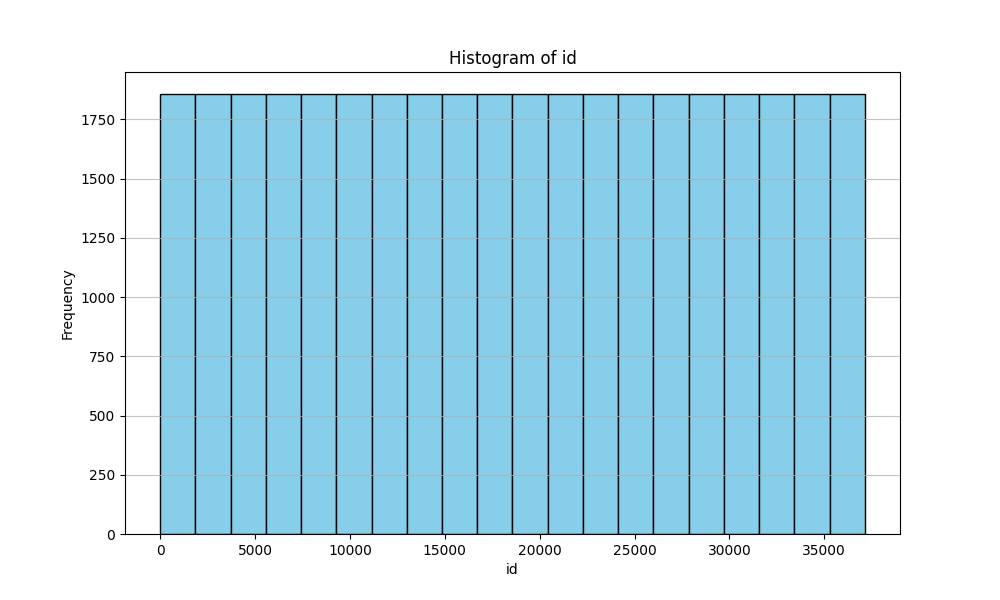
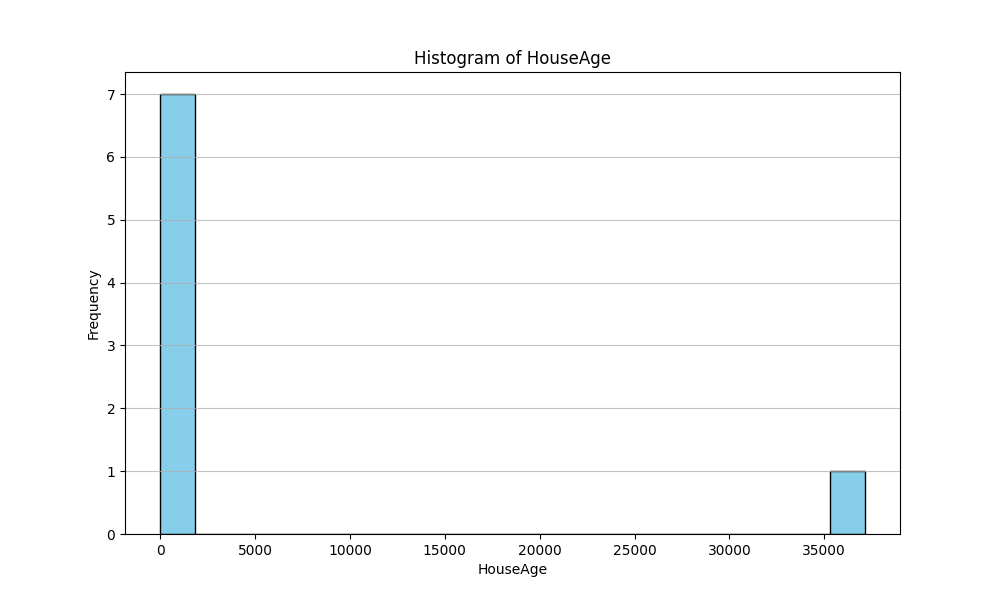
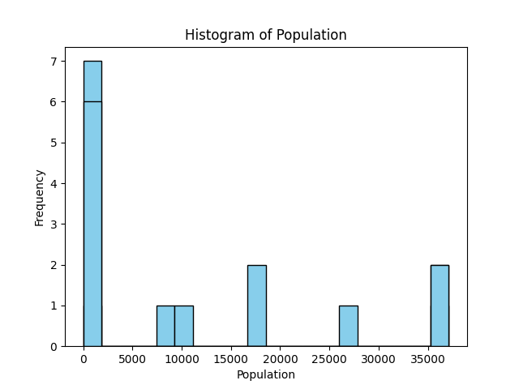

## Houseprice Analysis Project

This project provides some barebones analysis framework for any dataframe, using the Californian House Price data as an example.

Simply run `make all` to run the analysis and generate the reports. 

## Demo

Demo Video is here: 

## Project Structure:
- Makefile: Contains commands to build, test, deploy and generates the report in the project
- notebook.ipynb is the notebook that contains the bulk of the analysis
- main.py contains the main analysis that creates the figures and analysis
- requirements.txt contains the main libraries requirements
- mylib contains the helper functions used in this project
- test_main.py contains the tests for the main functions
- test_lib.py contains the tests for the helper functions in mylib
- train.csv is the main data we're using here
- *.png files are the visualizations generated by the project  
- .devcontainer contains the Dockerfile and the devcontainer.json file for container environment

## Analysis

We can see the distribution of id's in the housing data
 

There's also a histogram of the age of the houses.

And a histogram of the population of the cities of the houses.

