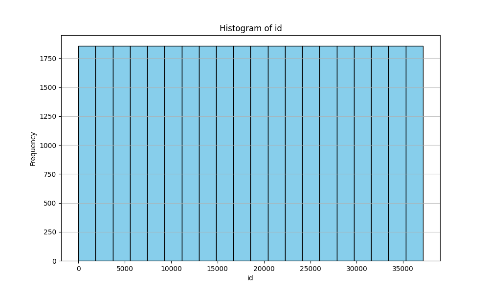
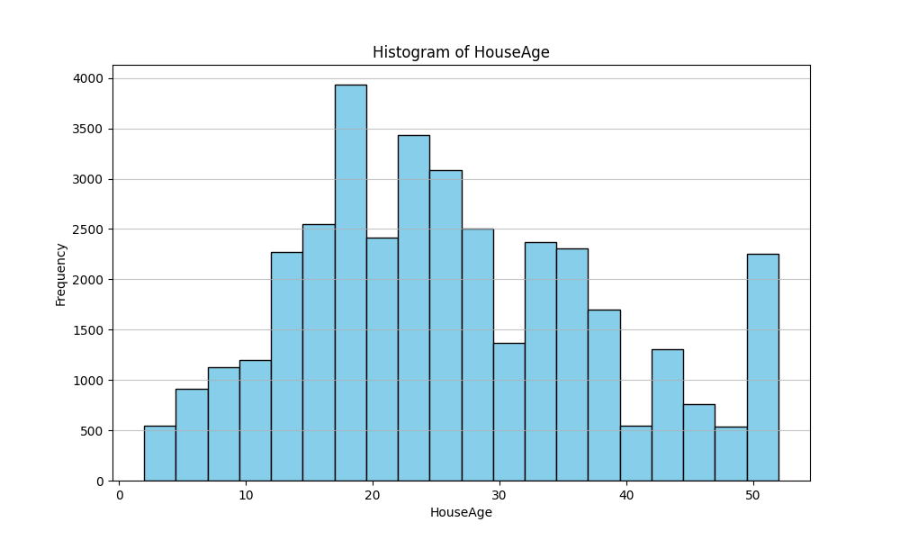
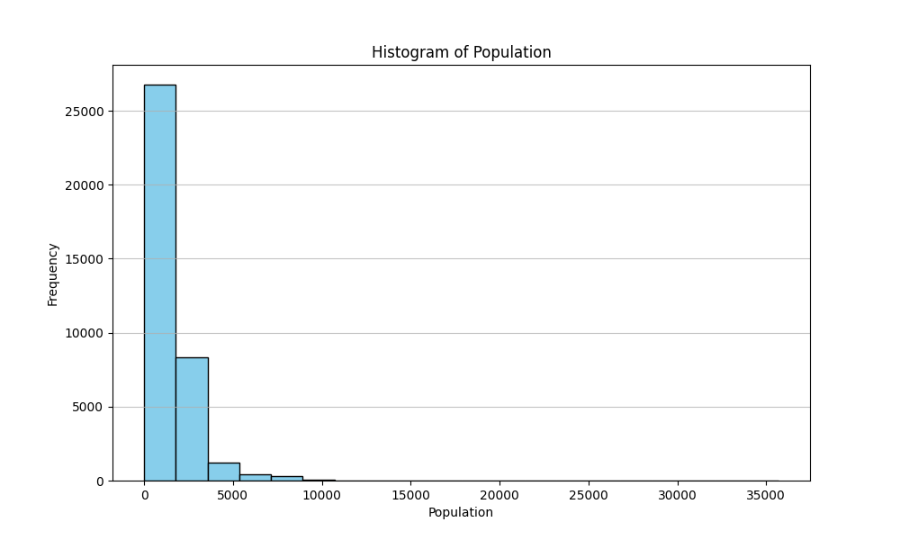

    # This is a sample report 
    
    ## Behold, analysis
    
    We can see the distribution of id's in the housing data
    

    There's also a histogram of the age of the houses.

    

    And a histogram of the population of the cities of the houses.

    
    